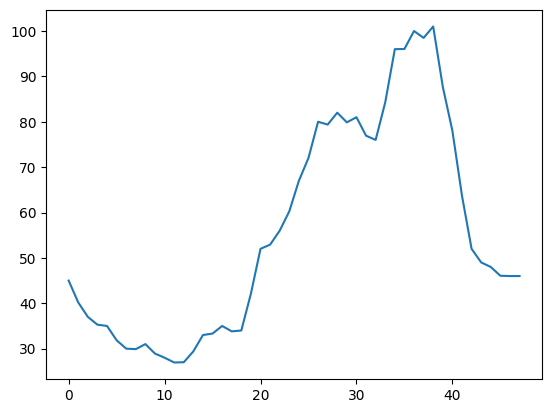

# nbdev-demo

<!-- WARNING: THIS FILE WAS AUTOGENERATED! DO NOT EDIT! -->

## Install

``` sh
pip install nbdev_demo
```

## How to use

Using nbdev-demo library is so simple! Follow the steps to predict half
hourly prices from hourly prices.

``` python
from nbdev_demo.data_handler import *
from nbdev_demo.main_strategy import predict_prices
```

Get data first and do transformations.

``` python
data = some_api_call()
df = transform_data(data)
df = convert_to_float(df)
```

``` python
df.head()
```

<div>
<style scoped>
    .dataframe tbody tr th:only-of-type {
        vertical-align: middle;
    }
&#10;    .dataframe tbody tr th {
        vertical-align: top;
    }
&#10;    .dataframe thead th {
        text-align: right;
    }
</style>

|     | time | price |
|-----|------|-------|
| 0   | 0    | 45.0  |
| 1   | 1    | 37.0  |
| 2   | 2    | 35.0  |
| 3   | 3    | 30.0  |
| 4   | 4    | 31.0  |

</div>

Use prediction function to predict half hourly prices

``` python
half_hourly_prices = predict_prices(df)
```

``` python
half_hourly_prices.head()
```

<div>
<style scoped>
    .dataframe tbody tr th:only-of-type {
        vertical-align: middle;
    }
&#10;    .dataframe tbody tr th {
        vertical-align: top;
    }
&#10;    .dataframe thead th {
        text-align: right;
    }
</style>

|     | time | prices |
|-----|------|--------|
| 0   | 0.0  | 45.00  |
| 1   | 0.5  | 40.18  |
| 2   | 1.0  | 37.00  |
| 3   | 1.5  | 35.28  |
| 4   | 2.0  | 35.00  |

</div>

``` python
import matplotlib.pyplot as plt
plt.plot(half_hourly_prices['prices'])
plt.show()
```


